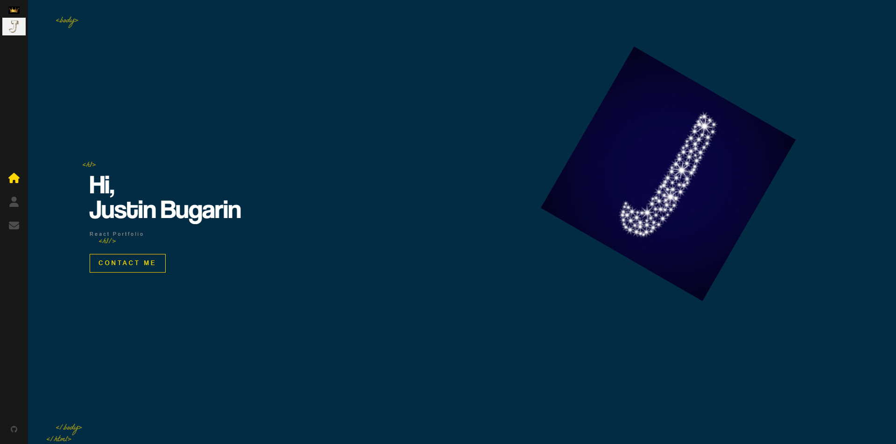
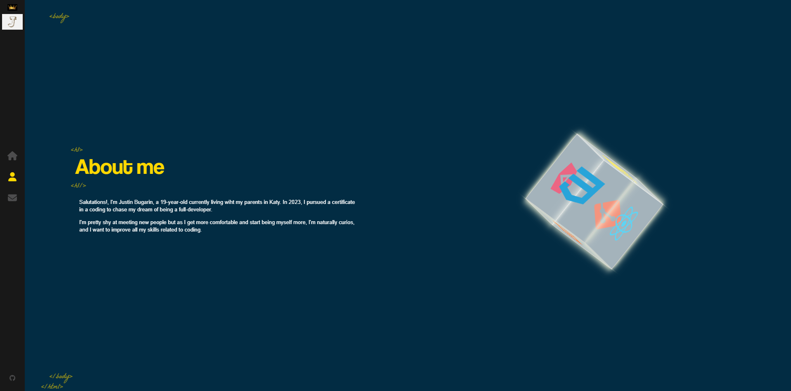
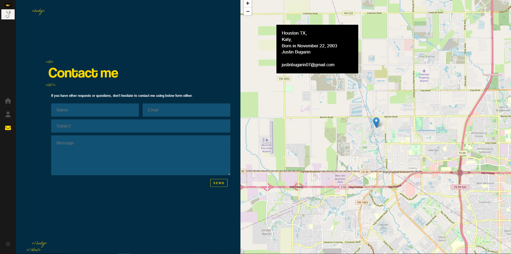

# React Challange : React Portfolio


## Description 

Being a web developer means being part of a community. We all need a place to share our projects not only if we're applying for jobs or working as a freelancer but also so that we can share our work with fellow developers and collaborate on future projects. 


## Table of Contents
* [License](#license)
* [Installation](#installation)
* [User Story](#user-story)
* [Acceptance Criteria](#acceptance-criteria)
* [Screenshots](#screenshots)
* [Link](#link)
* [Usage](#usage)

## License 
This project is license under MIT 


## Installation 

1. Clone the repository from GitHub
1. Install `node.js`
1. Run `npm install` to install dependencies. 
1. Run `npm start` to start the web server and connect

## User Story

```md
AS AN employer looking for candidates with experience building single-page applications
I WANT to view a potential employee's deployed React portfolio of work samples
SO THAT I can assess whether they're a good candidate for an open position
```


## Acceptance Criteria

```md
GIVEN a single-page application portfolio for a web developer
WHEN I load the portfolio
THEN I am presented with a page containing a header, a section for content, and a footer
WHEN I view the header
THEN I am presented with the developer's name and navigation with titles corresponding to different sections of the portfolio
WHEN I view the navigation titles
THEN I am presented with the titles About Me, Portfolio, Contact, and Resume, and the title corresponding to the current section is highlighted
WHEN I click on a navigation title
THEN I am presented with the corresponding section below the navigation without the page reloading and that title is highlighted
WHEN I load the portfolio the first time
THEN the About Me title and section are selected by default
WHEN I am presented with the About Me section
THEN I see a recent photo or avatar of the developer and a short bio about them
WHEN I am presented with the Portfolio section
THEN I see titled images of six of the developer’s applications with links to both the deployed applications and the corresponding GitHub repository
WHEN I am presented with the Contact section
THEN I see a contact form with fields for a name, an email address, and a message
WHEN I move my cursor out of one of the form fields without entering text
THEN I receive a notification that this field is required
WHEN I enter text into the email address field
THEN I receive a notification if I have entered an invalid email address
WHEN I am presented with the Resume section
THEN I see a link to a downloadable resume and a list of the developer’s proficiencies
WHEN I view the footer
THEN I am presented with text or icon links to the developer’s GitHub and LinkedIn profiles, and their profile on a third platform (Stack Overflow, Twitter) 
```

## Screenshots 






## Link 
<a href="https://github.com/JustinBugarin/React-Challenge-React-Portfolio/">Git Hub React Portfolio</a>

## Usage 

To create a portfolio, using React. The user can review and About Me section, a sample Portfolio, a contact form, and be able to download the Resume.